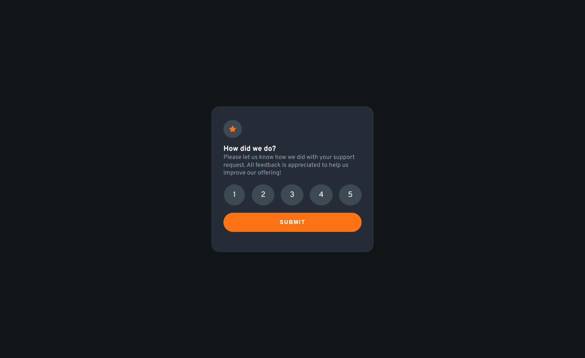
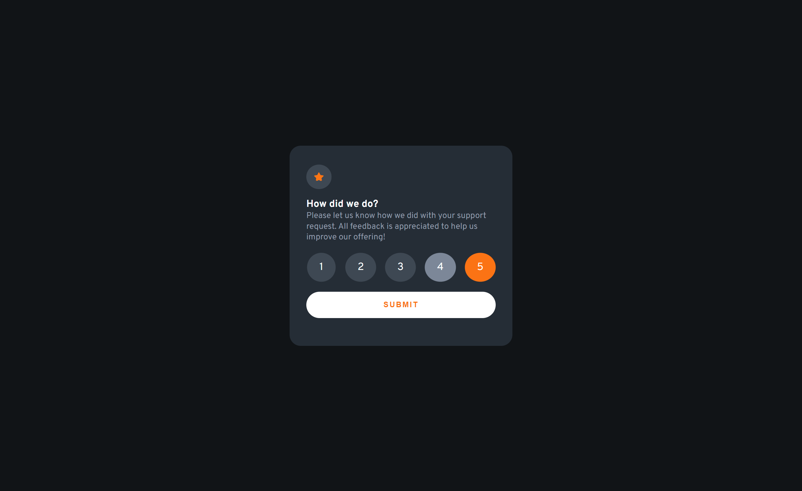
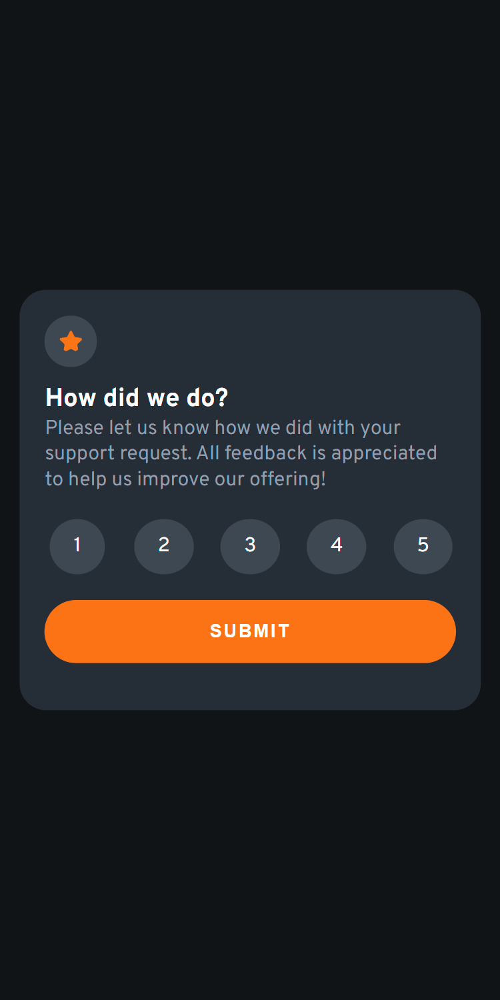
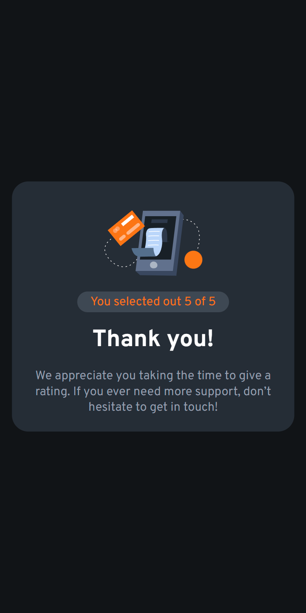

# Frontend Mentor - Interactive rating component solution

This is a solution to the [Interactive rating component challenge on Frontend Mentor](https://www.frontendmentor.io/challenges/interactive-rating-component-koxpeBUmI). Frontend Mentor challenges help you improve your coding skills by building realistic projects.

## Table of contents

- [Overview](#overview)
  - [The challenge](#the-challenge)
  - [Screenshot](#screenshot)
  - [Links](#links)
- [My process](#my-process)
  - [Built with](#built-with)
  - [What I learned](#what-i-learned)
  - [Useful resources](#useful-resources)
- [Author](#author)

## Overview

### The challenge

Users should be able to:

- View the optimal layout for the app depending on their device's screen size
- See hover states for all interactive elements on the page
- Select and submit a number rating
- See the "Thank you" card state after submitting a rating

### Screenshot

### Links

- Solution URL: (https://github.com/ygabdn29/interactive-rating-component)
- Live Site URL: (https://ygabdn29.github.io/interactive-rating-component/)

## My process

### Built with

- HTML5
- Flexbox
- CSS Grid
- Mobile-first workflow

### What I learned

In this challenge I'm exercising what I have learned about using Javascript to create a more versatile web pages, like using it to hide and show some element and saving value from a markup element so that I can use it to create a new element containing said value. Aside from that, in this challenge I tried mobile-first when developing the solution and keeps on exercising my css layouting skill using flexbox and grid.

### Useful resources

- [MDN](https://developer.mozilla.org/en-US/)
- [Stackoverflow](https://stackoverflow.com/)
- [CSS-Tricks](https://css-tricks.com/snippets/css/complete-guide-grid/)

## Author

- Yoga Budiman
